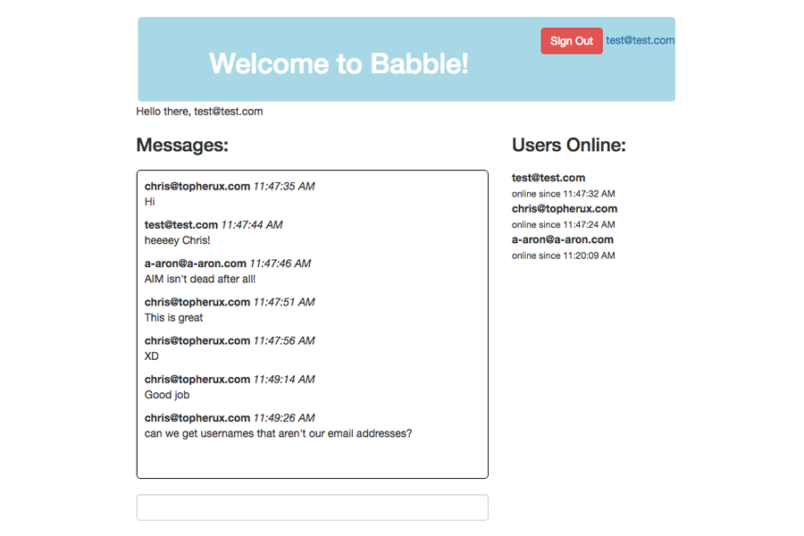

# Babble, a chat app built with the Phoenix/Elixir framework

**Screenshot of application**

## Live link, deployed on Heroku
[Deployed application](https://babble.herokuapp.com/)

## Approach to building babble

The inspiration to build Babble came after I participated in a hackathon. One of my teammates mentioned Phoenix/Elixir and showed me a chat app that she built with the framework. This sparked my curiousity, and I wanted to set out to learn about it on my own. After doing some research, I found a great 3-part tutorial on YouTube that explained very well the basics behind building a Phoenix chat app (see link below).

## User stories

• A user wants to create an account

• A user wants to see other users online

• A user wants chat with other users

• A user wants to edit/update their profile

• A user wants to delete their profile

## Helpful links

- Found a great 3-part tutorial by Tensor Programming on [Youtube](https://www.youtube.com/watch?v=irDC1nWKhZ8)

- [Phoenix Framework](http://phoenixframework.org/) Documentation
